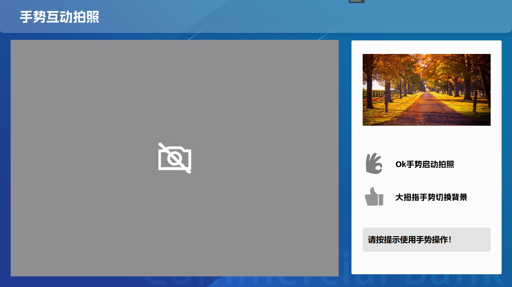
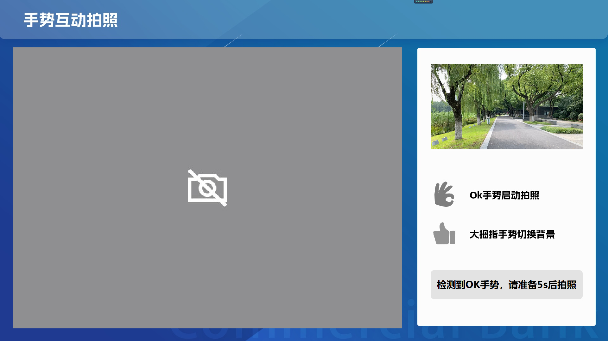
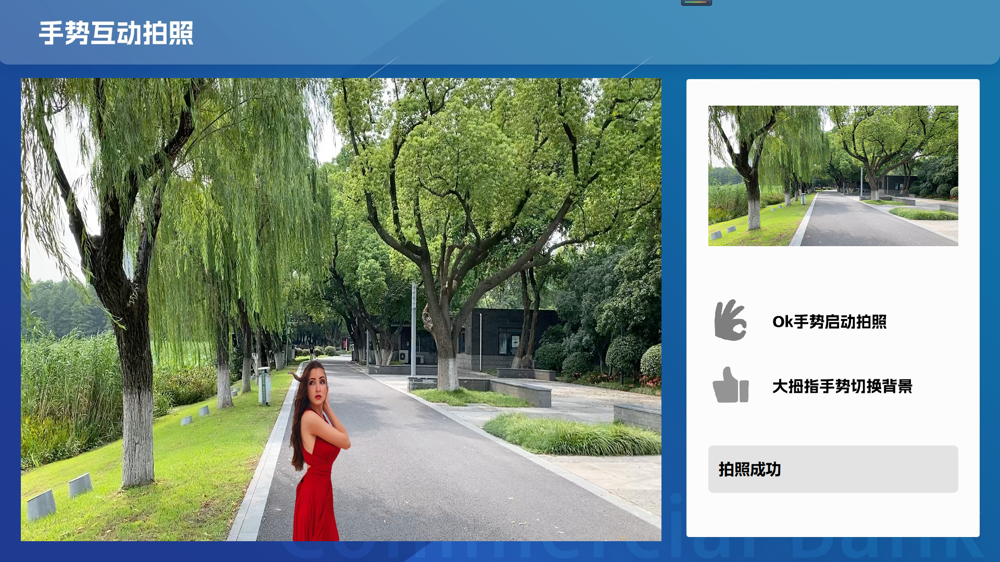

# 手势拍照

## 介绍
通过手势识别控制软件系统，切换背景图片，拍照后将人像前景扣出无缝合成到背景图。借助AI自动抠图实现背景图切图，实现足不出户大江南北去打卡的效果。

## gitee
- 图片不看不了访问gitee：https://gitee.com/rmysoft/gesture-photography

## 测试下载

链接：https://pan.baidu.com/s/1tT3rtPmlLukyZ9YdtMROdg?pwd=jnhx

## 演示视频
https://www.bilibili.com/video/BV1qh4y1177G/

## 软件示例

## 欢迎赞赏
赞赏99元获取源码!备注邮箱会第一时间发送！ 

